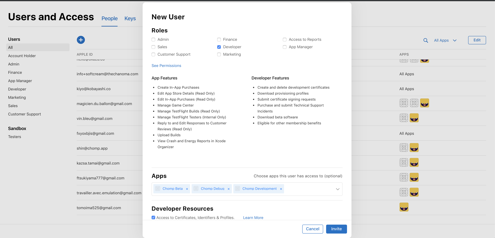

☀️

## Running iOS app on a real device

- You don't have to pay for running on a device
- https://developer.apple.com/library/archive/documentation/ToolsLanguages/Conceptual/Xcode_Overview/RunningonaDevice.html
- https://www.twilio.com/blog/2018/07/how-to-test-your-ios-application-on-a-real-device.html

### Certification was not valid

- I have to give an access to `Developer Resources` to use Certification(there were no check on my account)

## Debounce on Change

- You'd want to debounce some extra work that is triggered by changes so that input does not get blocked
- https://github.com/facebook/react/issues/1360#issuecomment-333969294

## Training

- 6 min abs training
- 50 abs roller
- 60 push ups
