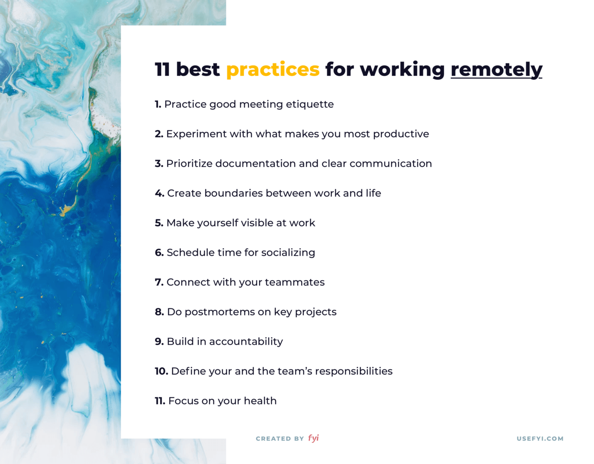

☀️

## Notification on iOS

- device token should not be stored locally; should be fetched at anytime.
- Device token can be updated by iOS re-install

https://developer.apple.com/documentation/watchkit/wkextensiondelegate/3141924-didregisterforremotenotification
https://stackoverflow.com/questions/6652242/does-the-apns-device-token-ever-change-once-created
https://developer.apple.com/library/archive/documentation/NetworkingInternet/Conceptual/RemoteNotificationsPG/HandlingRemoteNotifications.html#//apple_ref/doc/uid/TP40008194-CH6-SW1

## Estimation, Target, Commitment

- 97 Things Every Programmer Should Know https://learning.oreilly.com/library/view/97-things-every/9780596809515/ch50.html
- An estimate is an approximate calculation or judgment of the value, number, quantity, or extent of something. This definition implies that an estimate is a factual measure based on hard data and previous experience—hopes and wishes must be ignored when calculating it. The definition also implies that, being approximate, an estimate cannot be precise, e.g., a development task cannot be estimated to last 234.14 days.

- A target is a statement of a desirable business objective, e.g., “The system must support at least 400 concurrent users.”

- A commitment is a promise to deliver specified functionality at a certain level of quality by a certain date or event. One example could be “The search functionality will be available in the next release of the product.”
- Estimates, targets, and commitments are independent from one another, but targets and commitments should be based on sound estimates.

## Caching Podfiles on iOS

- https://discuss.circleci.com/t/how-to-cache-cocoapods/28857
- Should `pod install` be called even the cache is restored? :thinking_face:
- https://blog.takescoop.com/improve-ios-ci-build-time-with-cocoapods-caching-4a049ee45e63
- Reduce iOS build time by caching pod file on S3 https://blog.takescoop.com/improve-ios-ci-build-time-with-cocoapods-caching-4a049ee45e63
- Caching Circle CI https://circleci.com/docs/2.0/caching/

## Remote work practice

- https://usefyi.com/remote-work-best-practices/

## Training

- NA
