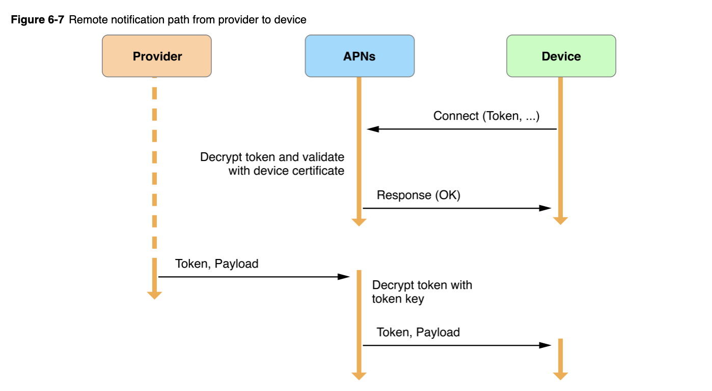

☀️

# Wix react native notification

## Subscription

- https://github.com/wix/react-native-notifications/blob/master/docs/subscription.md

# iOS Notification in detail

## Overview

- https://developer.apple.com/library/archive/documentation/NetworkingInternet/Conceptual/RemoteNotificationsPG/APNSOverview.html#//apple_ref/doc/uid/TP40008194-CH8-SW1



## Payload

- https://developer.apple.com/library/archive/documentation/NetworkingInternet/Conceptual/RemoteNotificationsPG/PayloadKeyReference.html#//apple_ref/doc/uid/TP40008194-CH17-SW1
- The main contents of the aps dictionary determine whether the system does any of the following:
  - Displays an alert message to the user
  - Applies a badge to the app’s icon
  - Plays a sound
  - Delivers the notification silently

## Registering notification at App.m

- https://developer.apple.com/documentation/usernotifications/registering_your_app_with_apns

```
func application(_ application: UIApplication,
           didFinishLaunchingWithOptions launchOptions:
           [UIApplicationLaunchOptionsKey: Any]?) -> Bool {
   // Override point for customization after application launch.

   UIApplication.shared.registerForRemoteNotifications()
   return true
}

func application(_ application: UIApplication,
            didRegisterForRemoteNotificationsWithDeviceToken
                deviceToken: Data) {
   self.sendDeviceTokenToServer(data: deviceToken)
}

func application(_ application: UIApplication,
            didFailToRegisterForRemoteNotificationsWithError
                error: Error) {
   // Try again later.
}
```

- https://developer.apple.com/documentation/uikit/uiapplication/1623078-registerforremotenotifications

# Workouts

- 6min abs
- 60 pushups
