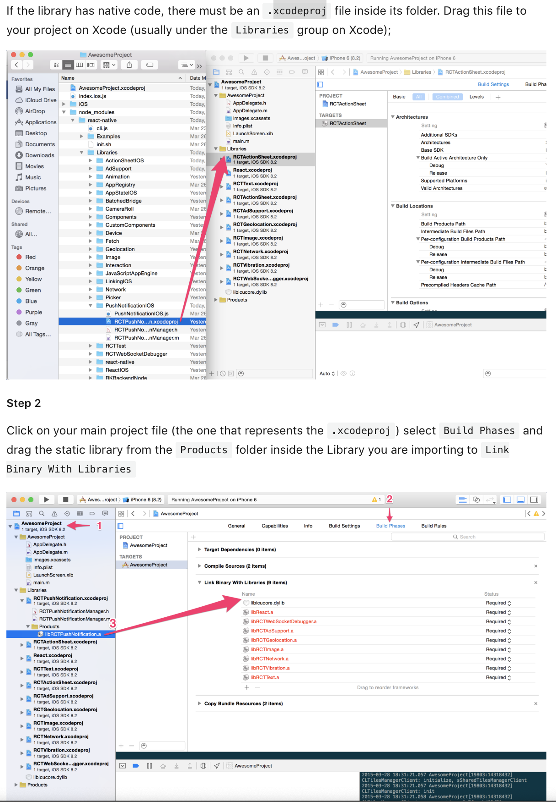

☀️

# wix notification issue

## Receiving push when the app is closed

- https://github.com/wix/react-native-notifications/issues/386
  - 2.x versions removed background notification support for iOS.
- Able to get background notification with code below

```
componentDidMount() {

    NotificationsIOS.addEventListener('notificationReceivedForeground', this.handleNotification);
    // When app is in background
    NotificationsIOS.addEventListener('notificationOpened', this.handleNotification);
    // When app is closed
    this.checkIfLaunchedByPushNotification();
  }

  componentWillUnmount() {
    NotificationsIOS.removeEventListener('notificationReceivedForeground', this.handleNotification);
    NotificationsIOS.removeEventListener('notificationOpened', this.handleNotification);
  }

  checkIfLaunchedByPushNotification = () => {
    NotificationsIOS.getInitialNotification().then(notification => {
      if (notification) {
        this.handleNotification(notification);
      }
    })
  }
}
```

## interface update

- https://github.com/wix/react-native-notifications/pull/342/files

# Manually linking libraries on iOS

- copy referencee of `xcodeproj`
- copy `lib.a` with `Link Binary With Libraries)

- https://facebook.github.io/react-native/docs/linking-libraries-ios.html#manual-linking



# Spread operator in JSX

- https://reactjs.org/docs/jsx-in-depth.html#spread-attributes
- spreading props is bug prone

# iOS add asset

- https://github.com/codepath/ios_guides/wiki/Adding-Image-Assets

# 優れた経営者の条件

- 分析できない未来へ向けて、すぐに動くことができる「綜合力」がある人
  - 「センス」のある経営者というのは「すぐに体が動く人」だと思っています。なぜかというと、そんなに大切なことだったら、今の時点で大体皆さん、もう知っているはずなんです。
- 「何をしないか」を決めることで他社と「Different」になった
  - 「Better」を見つけてやるよりも、お客さんから見たときに「違い」がはっきり分かるようにする
  - 「何をしないか」を決められない人は、リーダーでいる積極的な理由はないと僕は思います。当たり前なのですが、資源制約がない人には、「戦略」は必要ないんですよ。全部、思いっきりやればいいだけですから。ところが、現実の経営は常に資源制約がかかっているんですよね。「何かを頑張る」ということは「何かをやらない」ということと同じなんですね。
- 戦略は「組み合わせ」ではなく「順列」なのです。つまり、戦略には「時間」という要素が関わっているんです
  - 「旬の飛び道具」を、皆さんの戦略ストーリーの中にどうやって位置づけるのか。それが問題なんですね。
- https://www.rakuten.ne.jp/gold/_event/business-insight/027/
- https://www.rakuten.ne.jp/gold/_event/business-insight/029/
- https://www.rakuten.ne.jp/gold/_event/business-insight/032/

# Workout

- NA
