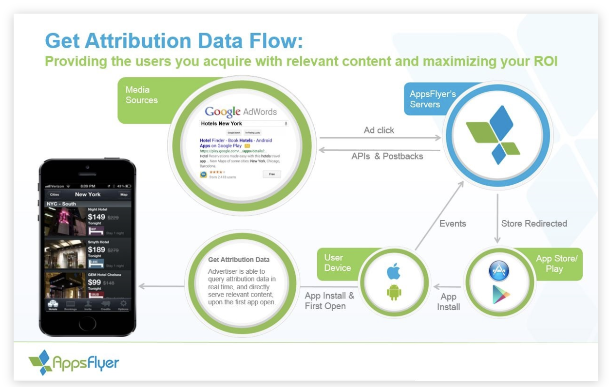

☀️

# Apple ID

- https://learn.apptentive.com/knowledge-base/finding-your-app-store-id/

# Segment - AppsFlyer integration

- https://segment.com/docs/destinations/appsflyer/
- https://segment.com/docs/spec/mobile/#install-attributed
- https://github.com/AppsFlyerSDK/react-native-appsflyer/blob/master/Docs/Guides.md

```
Install Attributed
When Segment or an integrated partner can discern the source of an install, we’ll collect an Install Attributed event. This event may be sent to Segment via server-to-server connection from your attribution provider, or directly on the device via packaged destinations. In either case, this will happen after install, and does not apply to all installs, which is why it is a discrete event.
```

- Conversion flow https://support.appsflyer.com/hc/en-us/articles/207032096-Accessing-AppsFlyer-Attribution-Conversion-Data-from-the-SDK-Deferred-Deeplinking-#introduction

  

- Testing https://support.appsflyer.com//hc/en-us/articles/115000262823

# Android developer challenge

- https://developer.android.com/dev-challenge

# Interview question idea

- How to implement event emitter on JS?

# Workout

- 80 push ups
- 6 min abs
